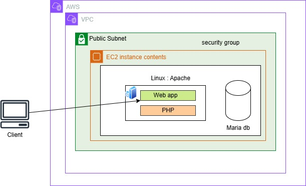

# 🚀 PHP Web Application Deployment on AWS EC2

This project showcases the deployment of a PHP-based web application on an Amazon EC2 instance within a Virtual Private Cloud (VPC). The setup involves a full web server stack running Apache and MariaDB, ideal for hosting dynamic web content.

---

## 📁 Architecture Overview

The application is hosted on an EC2 instance with the following configuration:

- **Operating System**: Amazon Linux 2
- **Web Server**: Apache HTTP Server
- **Backend**: PHP
- **Database**: MariaDB (on the same EC2 instance)
- **Client Access**: Through a public subnet
- **Security**: Managed via AWS Security Groups



---

## 🔧 Technologies Used

| Component       | Description                        |
|----------------|------------------------------------|
| AWS EC2         | Virtual server hosting the app     |
| AWS VPC         | Custom virtual private network     |
| Apache HTTPD    | Web server                         |
| PHP             | Server-side scripting language     |
| MariaDB         | Relational database                |
| Amazon Linux 2  | Operating system                   |
| Security Groups | Access control to the EC2 instance |

---

## 🛠️ Setup Instructions

### 1. Launch EC2 Instance

- Use **Amazon Linux 2 AMI**
- Instance type: `t2.micro` (Free Tier eligible)
- Configure within a **Public Subnet**
- Enable auto-assign **Public IP**
- Set up **Security Group** rules:
  - Allow HTTP (port 80)
  - Allow SSH (port 22)

### 2. Connect to EC2 via SSH

```bash
ssh -i your-key.pem ec2-user@<ec2-public-ip>
3. Install Apache, PHP, and MariaDB
bash
Copy
Edit
sudo yum update -y
sudo yum install -y httpd php mariadb-server
4. Start and Enable Services
bash
Copy
Edit
sudo systemctl start httpd
sudo systemctl enable httpd
sudo systemctl start mariadb
sudo systemctl enable mariadb
5. Deploy Web Application
Upload your PHP files to /var/www/html/

Set proper file permissions if needed

Connect your PHP app to MariaDB using mysqli or PDO

6. Secure MariaDB (Optional)
bash
Copy
Edit
sudo mysql_secure_installation
🌐 Access the Application
Once deployed, the application is accessible via:

cpp
Copy
Edit
http://<ec2-public-ip>/
Replace <ec2-public-ip> with your actual instance’s public IP address.

🔐 Security Best Practices
Restrict SSH access to your IP only

Do not expose port 3306 (MariaDB) to the internet

Use .env files or AWS Secrets Manager to store credentials

Configure SSL/TLS using Let’s Encrypt for HTTPS

🚀 Potential Enhancements
Host database on Amazon RDS instead of EC2

Set up SSL certificate for secure communication

Implement CI/CD pipeline using GitHub Actions or CodePipeline

Use EC2 Auto Scaling and Load Balancers for high availability

👨‍💻 Author
Elijah Mottey
📍 Kasoa Kakraba, Ghana
🔗 GitHub | LinkedIn

markdown
Copy
Edit

Let me know if you'd like to add a **live link**, **project name**, or the **PHP app code** to this `README.md`.


Tools


